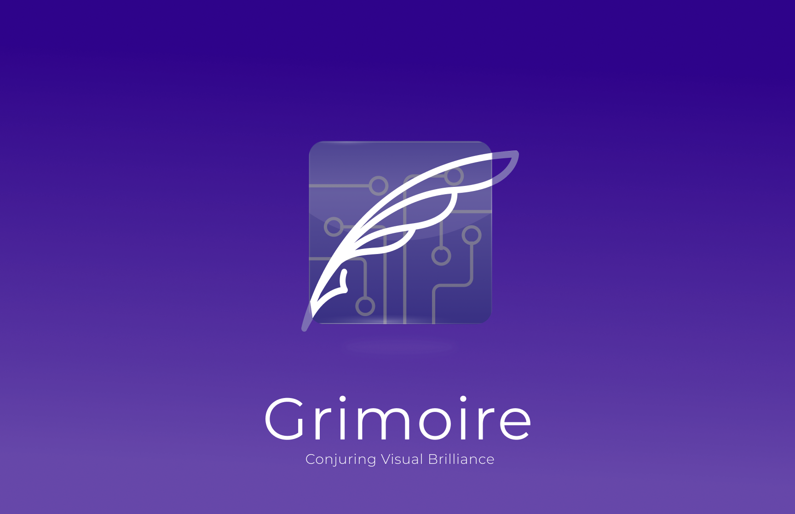
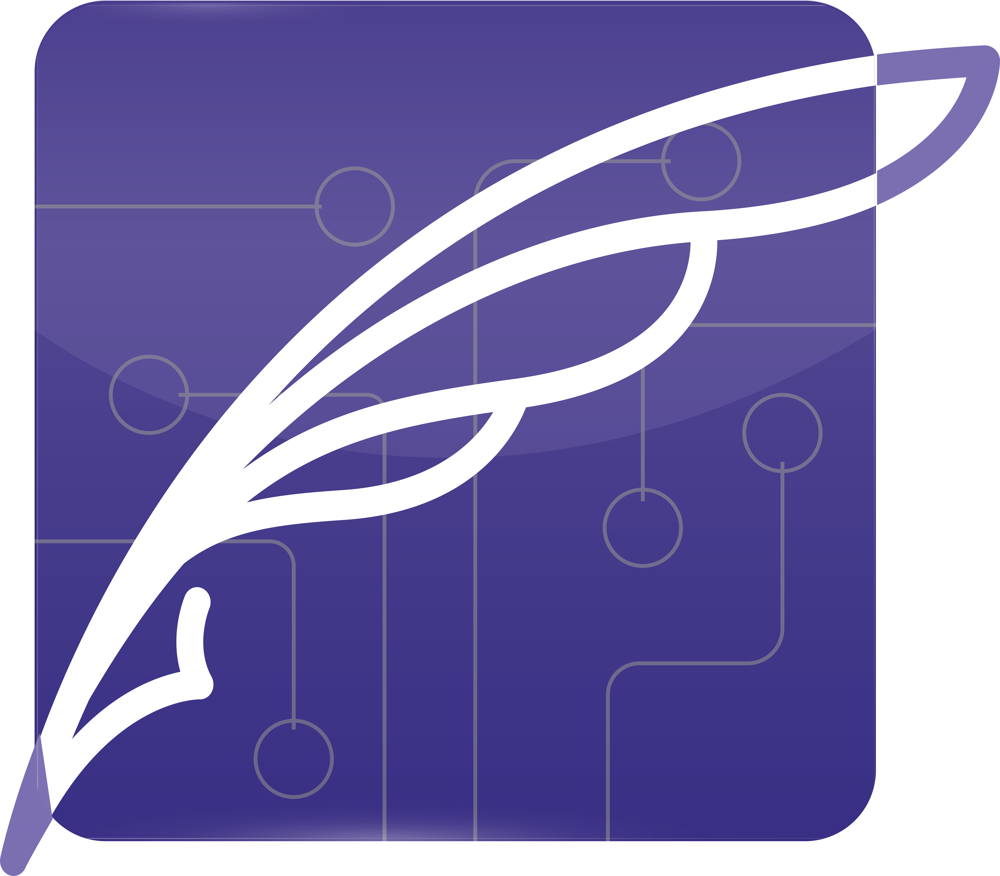

# Grimoire

<a href="https://gri-moire.vercel.app/">

</a>

[Grimoire](https://gri-moire.vercel.app/) is a powerful and intuitive ERD (Entity-Relationship Diagram) software designed to simplify the process of creating, managing, and visualizing database schemas. With its user-friendly interface and comprehensive feature set, Grimoire empowers developers, data analysts, and database administrators to efficiently design and communicate complex data structures.

> ⚠️ **DISCLAIMER**: Project Still under construction

## Screenshots

## Features

- [ ] **Interactive Diagram Creation**: Effortlessly create entities, attributes, and relationships using intuitive drag-and-drop gestures.
- [ ] **Data Modeling Tools**: Define entity attributes, data types, keys, relationships, and constraints.
- [ ] **Real-time Collaboration**: Enable seamless collaboration with multiple users working simultaneously.
- [ ] **Advanced Editing Capabilities**: Resize, reposition, and style entities, attributes, and relationships with ease.
- [ ] **Data Validation and Error Handling**: Detect and highlight potential issues in real-time for improved data consistency.
- [ ] **Export and Integration**: Export diagrams in multiple formats and integrate with popular database management systems (DBMS).
- [ ] **Extensibility and Customization**: Customize templates, styles, and themes to suit your preferences.
- [x] lorem ipsum 🐤.

## AI-Generated Schemas

Grimoire also offers an innovative AI-powered feature that generates initial database schemas based on natural language conversations. Users can interact with a chat interface to describe their data requirements, and the AI system intelligently generates a structured schema, which users can review and customize.

## Tools

- Grimoire leverages a variety of tools and technologies to deliver a powerful and intuitive database schema design and visualization experience. Here are the key tools used:

- MERN Stack: MongoDB, Express.js, React, and Node.js provide the foundation for building Grimoire, ensuring a robust and scalable web application.
- D3.js: Grimoire utilizes D3.js for dynamic and interactive diagram rendering, creating visually appealing representations of database schemas.
- Socket.IO: Real-time collaboration is made possible through Socket.IO, enabling seamless updates and synchronization across multiple users.
- Natural Language Processing (NLP): Grimoire incorporates NLP algorithms for - AI-generated entity diagram creation from natural language descriptions, simplifying the schema design process.
- Rust: Rust, a systems programming language known for its reliability and performance, is used for specific backend components in Grimoire.
- TypeScript: Grimoire is developed using TypeScript, a statically typed superset of JavaScript, providing enhanced developer productivity and code maintainability.
- Tauri: Tauri is used to create cross-platform desktop applications for Grimoire, ensuring a consistent user experience across different operating systems.
- Nextra: Nextra, a Markdown-based framework, is employed for Grimoire's documentation, allowing easy creation and customization of informative and user-friendly documentation.
- [Figma](https://www.figma.com/file/5IF4WStPtqjOAeRJaraB4M/Grimoire?type=design&node-id=1%3A2444&t=F5TEelkDC4Zq2Obp-1): UI/UX Design
- [Brand Guidelines & Logos]()
- Turbo Repo : For our monorepo

<a href="https://gri-moire.vercel.app/">

</a>
